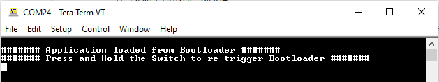
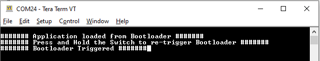

# Building and Running the CAN Bootloader applications

## Downloading and building the application

To clone or download this application from Github,go to the [main page of this repository](https://github.com/Microchip-MPLAB-Harmony/bootloader_apps_can) and then click Clone button to clone this repo or download as zip file. This content can also be download using content manager by following [these instructions](https://github.com/Microchip-MPLAB-Harmony/contentmanager/wiki)

Path of the application within the repository is **apps/can_bootloader/**

To build the application, refer to the following table and open the project using its IDE.

### Bootloader Application

| Project Name      | Description                                    |
| ----------------- | ---------------------------------------------- |
| bootloader/firmware/pic32mk_mcm_curiosity_pro.X    | MPLABX Project for [PIC32MK MCM Curiosity Pro Board](https://www.microchip.com/en-us/development-tool/EV31E34A)|

### Test Application

| Project Name      | Description                                    |
| ----------------- | ---------------------------------------------- |
| test_app/firmware/pic32mk_mcm_curiosity_pro.X    | MPLABX Project for [PIC32MK MCM Curiosity Pro Board](https://www.microchip.com/en-us/development-tool/EV31E34A)|

## Setting up [PIC32MK MCM Curiosity Pro Board](https://www.microchip.com/en-us/development-tool/EV31E34A)

- [PIC32MK MCM Curiosity Pro Board](https://www.microchip.com/en-us/development-tool/EV31E34A) is used for both **Host Development kit** and **Target Development kit**

    

- Connect DB9 male to male cable from J402 on [PIC32MK MCM Curiosity Pro Board](https://www.microchip.com/en-us/development-tool/EV31E34A)-1 to J402 on [PIC32MK MCM Curiosity Pro Board](https://www.microchip.com/en-us/development-tool/EV31E34A)-2
- Connect the USB to UART port (J400) to the computer using a micro USB cable for each board
- Connect the Debug USB port (J500) to the computer using a micro USB cable for each board
- Short (close) J20 Jumper for each board

## Building and Configuring CAN Host Applications

### Using CAN NVM Host application to send the application binary to Target development kit

If the NVM Host Development Kit being used is other than [PIC32MK MCM Curiosity Pro Board](https://www.microchip.com/en-us/development-tool/EV31E34A) then follow the steps mentioned in [Configuring NVM Host application project](../../docs/readme_configure_host_app_nvm.md#configuring-the-nvm-host-application)

1. Open the NVM host application project *host_app_nvm/firmware/pic32mk_mcm_curiosity_pro.X* in the IDE
    - If a NVM host application project of different development kit is used then open that project in the IDE

2. Build and program the NVM host application using the IDE on to the Host development kit
    - The prebuilt test application image available under **host_app_nvm/firmware/src/test_app_images/image_pattern_hex_pic32mk_mcm_curiosity_pro.h** will be programmed on to the Target development kit with default **host_app_nvm** project configuration

3. Jump to [Running The Application](#running-the-application)

## Running the Application

1. Open the bootloader project *bootloader/firmware/pic32mk_mcm_curiosity_pro.X* in the IDE
2. Build and program the application using the IDE on to the **Target development kit**
    - **LED3** will be turned-on to indicate that bootloader code is running on the target
    - **LED3** will also turn on when the bootloader does not find a valid application; i.e. the first word of the application (stack pointer), contains 0xFFFFFFFF

3. **If the test application is being programmed**, Open the Terminal application (Ex.:Tera Term) on the computer and configure the serial port settings for **Target Development kit** as follows:
    - Baud : 115200
    - Data : 8 Bits
    - Parity : None
    - Stop : 1 Bit
    - Flow Control : None

4. Press the Switch **SW1** on the Host development kit to trigger programming of the application binary
5. Once the programming is complete,
    - **LED3** on the Host development kit will be turned on indicating success

    - The target development kit will be reset. Upon re-start, the boot-loader will jump to the user application

    - If the test application is programmed then **LED3** should start blinking and you should see below output on the **Target development kit** console

        

6. Press and hold the Switch **SW1** to trigger Bootloader from test application and you should see below output

    

7. Press Reset button on the Host development kit to reprogram the application binary
8. Repeat Steps 4-5 once
    - This step is to verify that bootloader is running after triggering bootloader from test application in Step 6

## Additional Steps (Optional)

### Using CAN NVM Host application

- To bootload any application other than **host_app_nvm/firmware/src/test_app_images/image_pattern_hex_pic32mk_mcm_curiosity_pro.h** refer to [Application Configurations](../../docs/readme_configure_application_sam.md)

- Once the application is configured, Refer to [Configuring NVM Host application project](../../docs/readme_configure_host_app_nvm.md) for setting up the **host_app_nvm** project

- Once done repeat the applicable steps mentioned in [Running The Application](#running-the-application)
