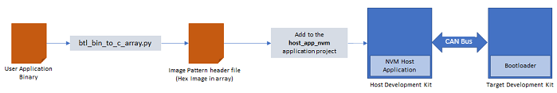
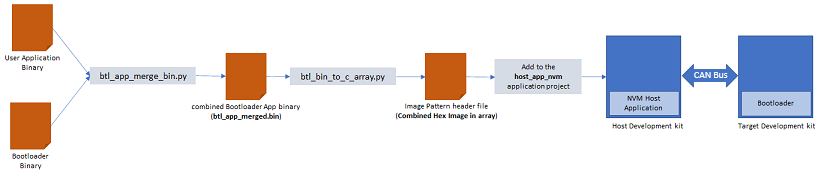

To clone or download this application from Github,go to the [main page of this repository](https://github.com/Microchip-MPLAB-Harmony/bootloader_apps_can) and then click Clone button to clone this repo or download as zip file. This content can also be download using content manager by following [these instructions](https://github.com/Microchip-MPLAB-Harmony/contentmanager/wiki)

# CAN Fail Safe Bootloader

This example application shows how to use the Bootloader Library to bootload an application on device having dual flash bank feature using CAN-FD protocol

### Bootloader Application

- This is a fail safe bootloader application which resides from starting location of both the banks of device flash memory region for SAM devices with dual bank support
- It uses CAN peripheral library in non-interrupt mode
- Trigger Methods
    - It uses the On board Switch as bootloader trigger pin to force enter the bootloader at reset of device
    - It checks for bootloader request pattern **(0x5048434D)** from the starting 16 Bytes of RAM to force enter bootloader at reset of device

### NVM Host Application

- This is a embedded CAN host application which sends the application image stored in it's internal flash (NVM) to the inactive bank of the target board over the CAN bus

- The user application binary must be converted to a header file containing the application image in HEX format in a C style array. A [btl_bin_to_c_array.py](../../tools/docs/readme_btl_bin_to_c_array.md) utility is provided to do this conversion

    

- To program the bootloader to the inactive flash bank, the user application binary may be combined with the bootloader using the [btl_app_merge_bin.py](../../tools/docs/readme_btl_app_merge_bin.md) utility. The combined binary file must be converted to a header file using the [btl_bin_to_c_array.py](../../tools/docs/readme_btl_bin_to_c_array.md) utility

    

- Add the generated image header file of the application or bootloader and application combined to the NVM host application project. Rebuild and program the NVM host application. This results in the application image being copied in the host MCU's flash (NVM)

### Test Application

- This is a test application which resides from end of bootloader size in device flash memory
- It will be loaded into flash memory by bootloader application
- It blinks an LED and provides console output
- It uses the On board Switch to trigger the bootloader from firmware
    - Once the switch is pressed it loads first 16 bytes of RAM with bootloader request pattern **(0x5048434D)** and resets the device

## Development Kits
The following table provides links to documentation on how to build and run CAN Fail Safe bootloader on different development kits

| Development Kit |
|:---------|
|[SAM E54 Xplained Pro Evaluation Kit](docs/readme_sam_e54_xpro.md) |

