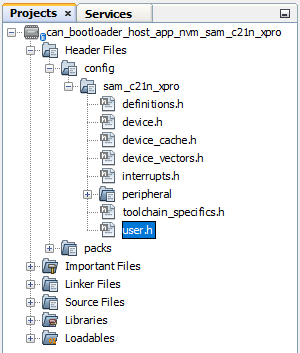
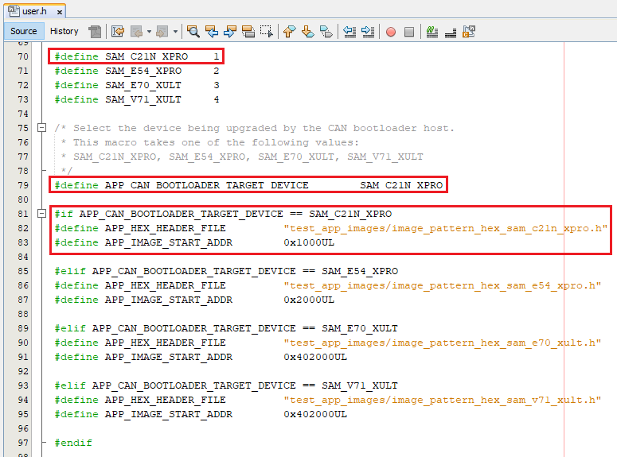

# Configuring the NVM Host applications

## Downloading and building the application

To clone or download this application from Github,go to the [main page of this repository](https://github.com/Microchip-MPLAB-Harmony/bootloader_apps_can) and then click Clone button to clone this repo or download as zip file. This content can also be download using content manager by following [these instructions](https://github.com/Microchip-MPLAB-Harmony/contentmanager/wiki)

### Path of the NVM host applications within the repository are
- **apps/can_bootloader/**
- **apps/can_fail_safe_bootloader/**

## Generating Hex Image pattern used by NVM Host application

### Follow below steps only when existing test_app is rebuilt or any other application is to be bootloaded

1. Open the application project to be bootloaded in the IDE
    - If existing test application has to be built open test_app/firmware/*.X

2. Build the application project to generate the binary **(Do not program the binary)**

3. Convert the generated binary (.bin file) to a header file containing the image data in a C style array:
    - On a Windows machine, open the command prompt and launch the **btl_bin_to_c_array.py** utility to generate a header file containing the image data in an array

          python <harmony3_path>/bootloader/tools/btl_bin_to_c_array.py -b <binary_file> -o <hex_file> -d <device>

    - Refer to [btl_bin_to_c_array utility](../../tools/docs/readme_btl_bin_to_c_array.md) for converting the binary to C array in hex format

        

4. Add the application hex header file generated in above step to the test app images path of the CAN embedded host application **host_app_nvm/firmware/src/test_app_images/**

    - **Example:**
        - If the application hex header file generated is for **sam_c21n_xpro.X** project, Name it as **image_pattern_hex_sam_c21n_xpro.h** and place it in above path

## Configuring the NVM Host application

### Follow below steps only when Host development kit is different than Target Development Kit

1. Open the host_app_nvm/firmware/*.X project in MPLABX IDE

2. Open the "user.h" file as shown below:

    

3. In the "user.h" file specify the Bootloader Target Device used using the predefined macros
       #define APP_CAN_BOOTLOADER_TARGET_DEVICE     SAM_C21N_XPRO

    

4. Navigate to the **#if block** for the specified **Bootloader Target Device** and verify the below settings are as expected.

    - **APP_HEX_HEADER_FILE:** Relative path to the generated header file containing the application hex image in an array
    - **APP_IMAGE_START_ADDR:** User application start address (This value should be same as the application start address specified in Application Configurations steps).
        - If the bootloader itself is being upgraded then the APP_IMAGE_START_ADDR must be set to:
			- 0x00 for SAM devices (start of bootloader)
			- 0x9d000000 for PIC32MK and PIC32MZ devices (start of program flash memory)
        - Ensure that the bootloader and application are also configured with the same value of user application start address
