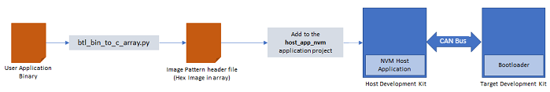

# CAN Bootloader

This example application shows how to use the Bootloader Library to bootload an application using

-   CAN-FD protocol for SAM devices

-   CAN 2.0 and CAN-FD protocol for PIC32MK, PIC32MX and PIC32MZ devices

**Bootloader Application**

-   This is a bootloader application which resides from

    -   Starting location of the device flash memory for SAM devices

    -   Starting location of the Boot flash memory region for PIC32MK, PIC32MX and PIC32MZ devices

-   It uses CAN peripheral library in non-interrupt mode

-   Trigger Methods

    -   It uses the On board Switch as bootloader trigger pin to force enter the bootloader at reset of device

    -   It checks for bootloader request pattern **\(0x5048434D\)** from the starting 16 Bytes of RAM to force enter bootloader at reset of device

**NVM Host Application**

-   This is a embedded CAN host application which sends the application image stored in it's internal flash \(NVM\) to the target board over the CAN bus

-   The user application binary must be converted to a header file containing the application image in HEX format in a C style array. A [btl\_bin\_to\_c\_array.py](GUID-AA3E00A3-26EF-40CA-8811-8E1D00F4C227.md) utility is provided to do this conversion

    

-   Add the generated application image header file to the NVM host application project. Rebuild and program the NVM host application. This results in the application image being copied in the host MCU's flash \(NVM\)

**Test Application**

-   This is a test application which resides from:

    -   End of bootloader size in device flash memory for SAM devices

    -   Starting location of the device Program memory for PIC32MK, PIC32MX and PIC32MZ devices

-   It will be loaded into flash memory by bootloader application

-   It blinks an LED and provides console output

-   It uses the On board Switch to trigger the bootloader from firmware **\(May not be supported on all devices\)**

    -   Once the switch is pressed it loads first 16 bytes of RAM with bootloader request pattern **\(0x5048434D\)** and resets the device

**Development Kits** The following table provides links to documentation on how to build and run CAN bootloader on different development kits

-   **[PIC32CZ CA80 Curiosity Ultra board: Building and Running the CAN Bootloader applications](GUID-F1405B56-597F-4DB4-82F7-5C590BA2814A.md)**  

-   **[PIC32MK GPE Development Kit: Building and Running the CAN Bootloader applications](GUID-EE533644-400F-470A-8C8B-75EF9D21B840.md)**  

-   **[PIC32MK MCJ Curiosity Pro Board: Building and Running the CAN Bootloader applications](GUID-A7E16685-893D-4F07-98C9-B1565AA73DA8.md)**  

-   **[PIC32MK MCM Curiosity Pro Board: Building and Running the CAN Bootloader applications](GUID-4C5805C4-5931-4B00-BBA9-F4485A7D5F09.md)**  

-   **[PIC32MZ EF Curiosity 2.0 Development Kit: Building and Running the CAN Bootloader applications](GUID-57825071-998B-4F2F-9469-11C587FA181F.md)**  

-   **[PIC32MZ W1 Curiosity Board: Building and Running the CAN Bootloader applications](GUID-21F92D30-6D2D-41FB-860E-2D2252C7DEA3.md)**  

-   **[SAM C21N Xplained Pro Evaluation Kit: Building and Running the CAN Bootloader applications](GUID-24BADA62-03E9-4A0C-8F9E-2805A8A24ED4.md)**  

-   **[SAM E54 Xplained Pro Evaluation Kit: Building and Running the CAN Bootloader applications](GUID-0A89799D-33D7-402F-8FEC-E5C4D9992503.md)**  

-   **[SAM E70 Xplained Ultra Evaluation Kit: Building and Running the CAN Bootloader applications](GUID-6B961C88-AB77-4251-8164-47C4A7A4EF13.md)**  

-   **[SAM V71 Xplained Ultra Evaluation Kit: Building and Running the CAN Bootloader applications](GUID-53738E42-E360-49E9-8501-2DC8B515430E.md)**  

**Parent topic:**[MPLAB® Harmony 3 CAN Bootloader Application Examples](GUID-6312510D-4637-4F9B-8A18-D2CCA5507E90.md)

