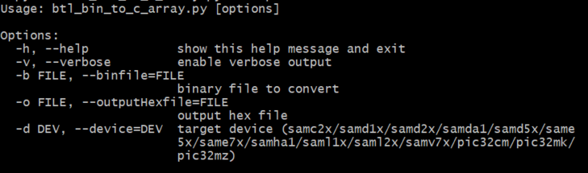

# Binary to C Array script help

This document describes the usage of **btl\_bin\_to\_c\_array.py** host script

**Parent topic:**[CAN Bootloader Tools Help](GUID-9D046685-A64F-49C0-833B-12F09D308B6B.md)

## Downloading the host script

To clone or download the host tools from Github,go to the [bootloader repository](https://github.com/Microchip-MPLAB-Harmony/bootloader) and then click Clone button to clone this repo or download as zip file. This content can also be download using content manager by following [these instructions](https://github.com/Microchip-MPLAB-Harmony/contentmanager/wiki)

### Path of the tool in bootloader repository is **tools/btl\_bin\_to\_c\_array.py**

## Setting up the Host PC

-   The Script is compatible with **Python 3.x** and higher


## Description

-   This script should be used to convert the binary file to a C style array containing Hex output that can be directly included in target application code

-   It is mainly used when programming the application using the host\_app\_nvm application in CAN Bootloader

-   If size of the input binary file is not aligned to device erase boundary it appends 0xFF to the binary to make it aligned and then generates the Hex output

-   User must specify the binary file to convert \(-b\), hex output file \(-o\) and the device \(-d\)

    


## Usage Examples

### Below is the syntax to show help menu for the script

```
python <harmony3_path>/bootloader/tools/btl_bin_to_c_array.py --help
```



### Below is the syntax and an example on how to convert the binary file to a C style array containing Hex output

```
python <harmony3_path>/bootloader/tools/btl_bin_to_c_array.py -b <binary_file> -o <hex_file> -d <device>
```

```c
python <harmony3_path>/bootloader/tools/btl_bin_to_c_array.py -b <harmony3_path>/bootloader_apps_can/apps/can_bootloader/test_app/firmware/sam_d20_xpro.X/dist/sam_d20_xpro/production/sam_d20_xpro.X.production.bin -o <harmony3_path>/bootloader_apps_can/apps/can_bootloader/host_app_nvm/firmware/src/test_app_images/image_pattern_hex_sam_d20_xpro.h -d samd2x
```

